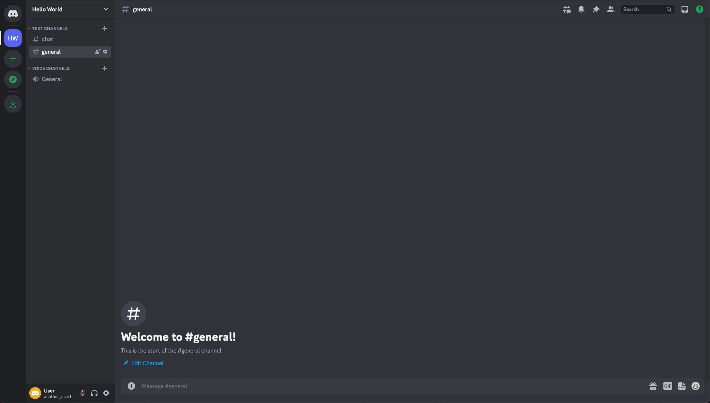

# Discord UI Challenge

Re-create this Discord Layout:

## Rules

* The main challenge is to re-create the layout as displayed in the image.
  * You do not have to re-create hover / click actions / menus / tooltips.
* You may use whatever CSS framework / JS framework you prefer.
  * A JS Framework would be useful to create re-usable components, but is not required

## Submission

Share a screenshot and a link to a github repo or codepen in the Coding Garden Discord.

## Colors

### Background Colors

* #1E1F22 - Server Selector Sidebar Background / Search Box Background
* #2B2D31 - Channel Selector Background
* #313338 - Channel Background
* #383A40 - Message Text Input Background
* #404248 - Highlighted / Selected Channel Name Background
* #232428 - User Info Background
* #F8A531 - User Icon Background
* #313338 - Server Icon Background
* #596AEE - Selected Server Icon Background

### Font Colors

* #FFFFFF - White
* #949BA3 - Grey Text
* #B5BAC1 - Grey Icon
* #1DA9F8 - Blue Text
* #666870 - Muted Text

### Misc Colors

* #27282C - Horizontal Separator
* #35363C - Server Separator
* #DBDEE1 - Discord Logo
* #F2F3F5 - Select Server Indicator
* #2CA45C - Green Icon
* #CACBCE - Grey Icon

## Icons

The [icons](./icons/) folder contains svg icons of all the icons you will need.

## Emoji Button

The `icons/emoji-sprite.png` file includes a sprite sheet of emojis. Each emoji is 22px by 22px.
